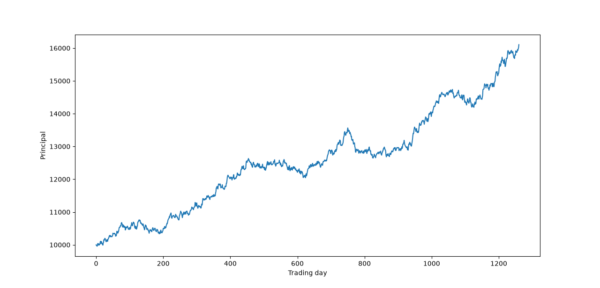
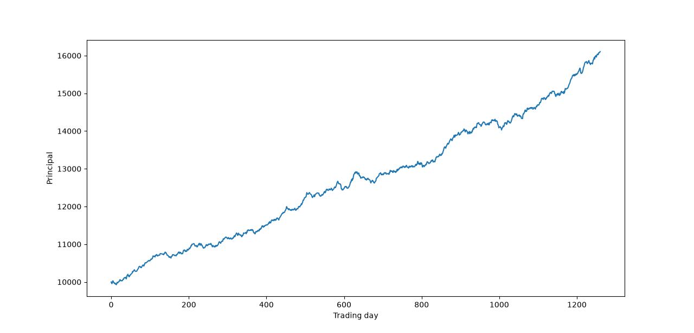
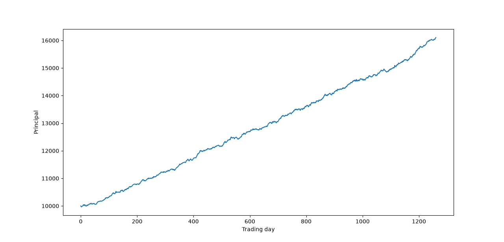
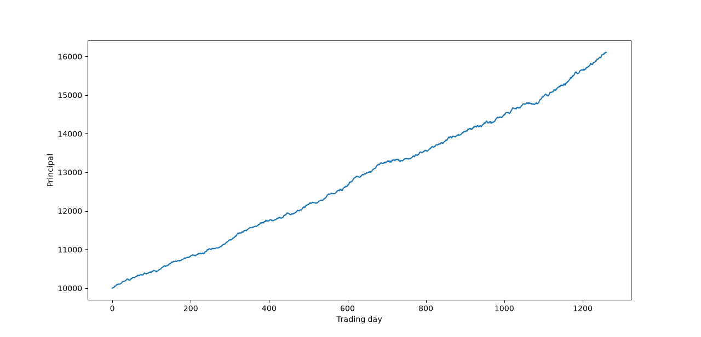

# Sharpe Ratio Simulation

A small personal project exploring how the Sharpe ratio affects the shape of simulated asset-price time series.

## Simulation

The program generates a random asset-price time series subject to:

* initial principal
* annual compound return
* annual risk-free rate
* annualized Sharpe ratio

The simulation generates standardized Gaussian random fluctuations, finds a scaling parameter `Lambda` that produces the requested Sharpe ratio, and then constructs the corresponding price series.

## Examples

The following examples use the same simulation parameters, with only the Sharpe ratio varied:

| Parameter              |   Value |
| ---------------------- | ------: |
| Initial principal      |  10,000 |
| Simulation period      | 5 years |
| Annual compound return |     10% |
| Annual risk-free rate  |      7% |

### Sharpe Ratio = 0.5



### Sharpe Ratio = 1.0



### Sharpe Ratio = 1.5



### Sharpe Ratio = 2.0



## Running

```text
pip install -r requirements.txt
python sharpe_ratio_simulation.py
```
